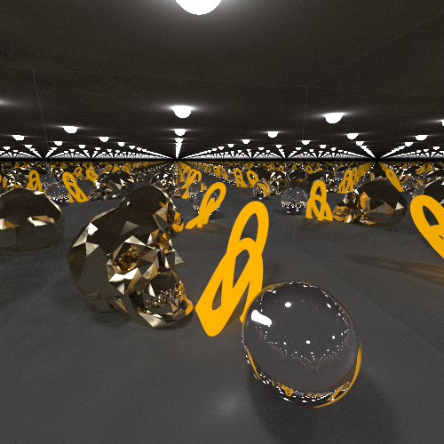
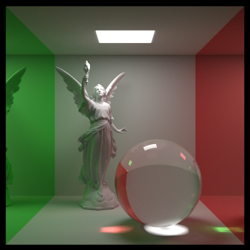
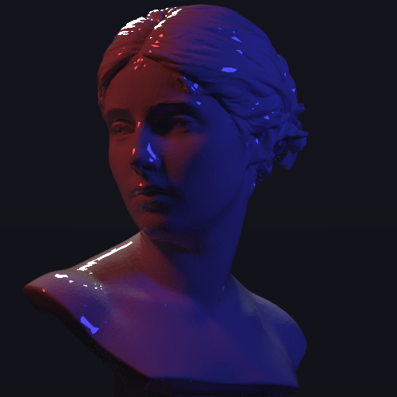
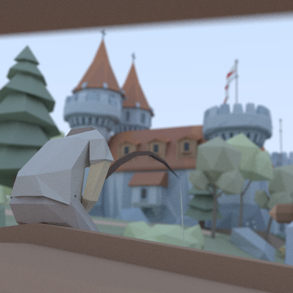
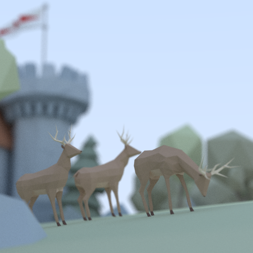

# 3D Graphics Renderer in Rust and WebAssembly

A high-performance 3D graphics renderer built with Rust, compiled to WebAssembly, and visualized in the browser using a React and TypeScript frontend. This project explores various rendering techniques, including rasterization and ray tracing, along with interactive scene manipulation.

[**Access the live demo right here in your browser!**](https://elliottf05.github.io/3D-Graphics/)


## Features

This project's 3D graphics engine, written in Rust and compiled to WebAssembly, offers two distinct rendering methods and several advanced features:

*   **Core Engine & Parallelism:**
    *   The engine combines a real-time rasterizer with a path-tracing ray tracer. Both rendering pipelines are accelerated using **Rayon for CPU-based multithreading**, speeding up demanding calculations. The core supports dynamic scene changes, including object transforms and material edits, through a web interface.

*   **Advanced Ray Tracing Capabilities:**
    *   Implements a **path tracer with Multiple Importance Sampling (MIS)** for realistic light simulation using direct light sampling via probabilistic Monte Carlo integration to reduce noise. It uses Russian Roulette for efficient path termination.
    *   Ray intersections are accelerated by a **cache-friendly flattened Bounding Volume Hierarchy (BVH)**, traversed iteratively.
    *   Supports **physically inspired materials** including dielectrics (glass with Snell's Law refraction and Schlick's Fresnel approximation), metals (configurable roughness), emissives, and a two-layer clear coat. Also realistically models depth of field camera effects.

*   **Real-Time Rasterization Techniques:**
    *   Features a real-time scanline triangle rasterizer with Z-buffering, perspective-correct interpolation, and near-plane clipping.
    *   Includes **shadow mapping for multiple lights** with basic filtering for softer shadows.
    *   Applies Phong lighting and a fast screen-space post-processing depth of field effect.

*   **Interactive Scene Editing & Control:**
    *   Web-based interface for real-time scene interaction. Users can move through the scene, pan around, and zoom in.
    * Users can choose from pre-defined scenes, or import their own 3D models in a GLB format. They can also add basic geometry and modify existing scene objects.

## Tech Stack

*   **Core Rendering Logic:** Rust
*   **Parallelism:** Rayon
*   **Frontend:** TypeScript, React
*   **UI Components:** Shadcn UI
*   **Styling:** Tailwind CSS
*   **Build Tool (Web):** Vite
*   **Deployment:** GitHub Pages

## Gallery








## Getting Started

### Prerequisites

*   Rust toolchain, available [here](https://www.rust-lang.org/tools/install)
*   A specific Rust nightly toolchain: `nightly-2024-08-02`. You can install it via `rustup toolchain install nightly-2024-08-02`.
*   `wasm-pack`, available [here](https://rustwasm.github.io/wasm-pack/installer/)
*   Node.js and npm

### Building and Running

1.  **Clone the repository:**
    ```bash
    git clone https://github.com/ElliottF05/3D-Graphics.git
    cd 3D-Graphics
    ```

2.  **Build the WebAssembly module:**
    Navigate to the `wasm-graphics` directory and run the build script:
    ```bash
    cd wasm-graphics
    ./build.sh 
    ```
    This will compile the Rust code into WebAssembly and place the output in the `web/wasm` directory.

3.  **Install frontend dependencies:**
    Navigate to the `web` directory:
    ```bash
    cd web
    npm install
    ```

4.  **Run the development server:**
    ```bash
    cd web
    npm run dev
    ```
    This will start the Vite development server, and you can access the application in your browser (usually at `http://localhost:5173`).

### Deployment

The project is configured for deployment to GitHub Pages. Pushing to the `main` branch will trigger the GitHub Actions workflow defined in [`.github/workflows/deploy.yml`](.github/workflows/deploy.yml) to build and deploy the `web/dist` folder.

## Future Work (Ideas)

*   Port the rendering logic to the GPU using WebGPU and the `wgpu` Rust crate to massively speed up rendering.

## Acknowledgements

*   Inspired by various resources on computer graphics, including "Ray Tracing in One Weekend" series.